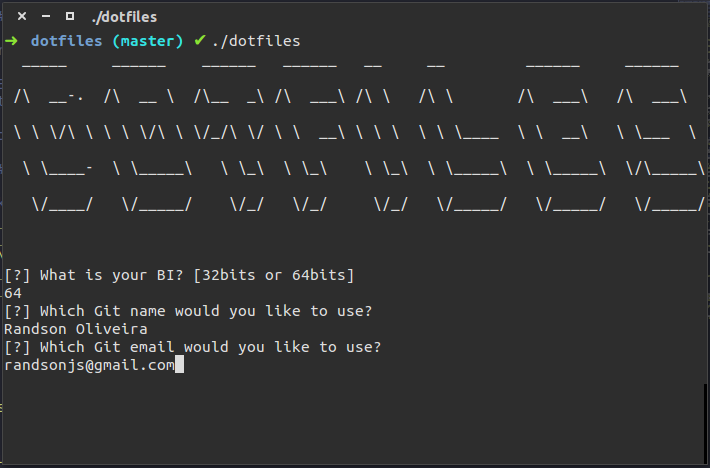

# Randson's dotfiles



My dotfiles for ubuntu, this setup will install everything I use on Ubuntu 14.04. You can also use, since it is setup installs really useful things. See below what it installs, I'll be happy if it is useful for you.

## Dependencies

For install `adobe-flashplayer` you need follow these steps:

1. Open `Software and Updates` in `System Settings`  and set Canonical Partners in Other Software.
2. Do nothing, the dotfiles will install for you :)

## How to install?

Download via `wget`:

```sh
$ wget https://github.com/randsonjs/dotfiles/archive/master.zip
```

We need the unzip file, following these commands: 

```sh
$ [sudo] unzip master.zip
```

The `unzip`command will create a `dotfiles-master` folder, we need enter in this directory:

```sh
$ cd dotfiles-master
```

And finnaly run: 

```sh
$ ./dotfiles
```

The dotfiles will ask your password a first time. And also confirm the installation of packages. For now, enjoy the codes in your terminal :)

## What's included?

All my command-line tools and it's configuration. Have fun :)

###### Shell

* [GIT](http://git-scm.com) for Version Control System
* [ZSH](http://zsh.org/) for shell
* [Oh my ZSH](https://github.com/robbyrussell/oh-my-zsh) for ZSH tweaking

###### Editors

* [Sublime Text 3](http://sublimetext.com/3) Code Editor

###### Themes

* [Spacegray](http://kkga.github.io/spacegray) for better theme on Sublime Text 3
* [Dracula]() for better syntax highlight for [ZSH](http://zsh.org/), [iTerm2](http://www.iterm2.com/) and [Alfred](http://www.alfredapp.com/)

###### General

* [Skype](http://skype.com) for chat and video messages
* [Numix](https://numixproject.org/) for better theme for ubuntu
* [Plank](http://wiki.go-docky.com/index.php?title=Plank:Installing)
* [Unity Tweak Tool](https://apps.ubuntu.com/cat/applications/unity-tweak-tool/) for manage themes and others stuff
* [Clementine](https://www.clementine-player.org/) the best music player
* [Chromium Browser](http://www.chromium.org/Home) Chromium Browser
* [Filezilla](https://filezilla-project.org/) for FTP Client
* [VLC Media Player](http://www.videolan.org/vlc/) for video player
* [Adobe Flash Player Plugin]() for videos on chromium
* [Pidgin](https://pidgin.im/) for chat client
* [GParted](http://gparted.org/) for partition edit
* [gitg](https://github.com/jessevdk/gitg) for UI git
* [Virtual Box](https://www.virtualbox.org/) for Virtual Machines

###### NodeJS

###### Ruby

###### PHP

* [cURL](http://curl.haxx.se/)
* [php5-cli](http://www.php-cli.com/) for PHP command line
* [Composer](http://getcomposer.org) for Dependency Manager for PHP

###### GitHub

* [xCLIP]() for copy ssh key to clipboard

## Credits

* Themes based on [@zenorocha Dracula](https://github.com/zenorocha/dracula-theme)

## Contributing

1. Fork it!
2. Create your feature branch: `git checkout -b my-new-feature`
3. Commit your changes: `git commit -am 'Add some feature'`
4. Push to the branch: `git push origin my-new-feature`
5. Submit a pull request :D

## License
[MIT License](./LICENSE) © Randson Oliveira
